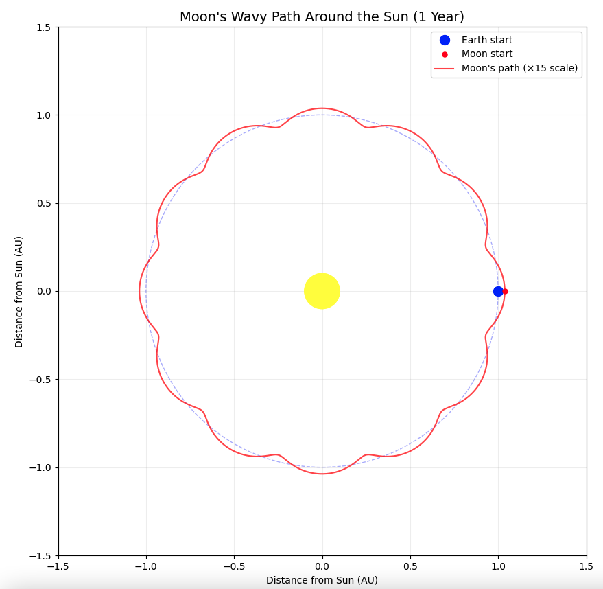
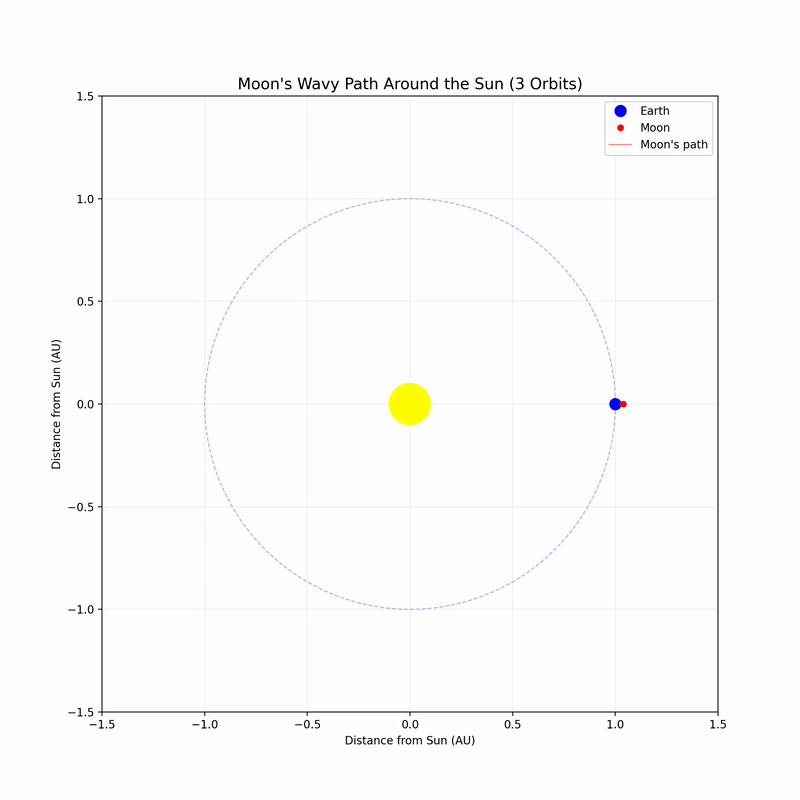

# Wavy Trajectory of the Moon around the Sun

When we imagine the Moon’s journey through space, it’s easy to picture a smooth, circular orbit—a neat ring around Earth, which itself circles the Sun. But the reality is more dynamic: the Moon’s trajectory around the Sun isn’t a perfect circle—it’s a wavy, looping path shaped by gravitational interplay. To highlight this, I created a Python animation that exaggerates and zooms in on the waviness, making its intricate motion stand out.

The Moon orbits Earth about 13 times during Earth’s year-long trip around the Sun. From our perspective, this looks like a near-circle, tilted slightly at 5.1 degrees to Earth’s path. Viewed from the Sun, though, the Moon weaves tight loops around Earth’s broader orbit, dipping inward and outward by roughly 384,000 kilometers—tiny compared to Earth’s 149.6 million-kilometer orbit, but enough to create a rippling wave.

Why isn’t it smooth? Gravity and motion are at play. The Moon circles Earth every 27.3 days while Earth races around the Sun at 30 kilometers per second, dragging the Moon along. This adds a side-to-side wobble, like a child skipping beside a walking adult, forming about 13 waves yearly instead of a flat ring.

In my animation, I magnified this wobble for clarity, zooming in to reveal the loops that are otherwise too subtle to notice. The result is a striking visual of the Moon’s path weaving around Earth’s orbit—a simplified yet vivid depiction of its cosmic dance. This waviness isn’t just pretty—it drives tides, stabilizes Earth’s tilt, and enables eclipses when alignments peak. The Moon’s trajectory proves that even simple orbits hide complex beauty, brought to life with a touch of code and curiosity.

---



To plot the trajectory in Python, use the following code, [View `moon.py`](Python/moon.py).  


## Moon's Wavy Path Plot

This Python script animates the Moon's trajectory around the Sun, showcasing its wavy, non-circular path as it loops around Earth's orbit. Unlike the common misconception of a smooth circle, the Moon’s motion weaves a series of tight waves—about 13 per Earth year—due to its orbit around Earth superimposed on Earth’s solar orbit. This project exaggerates and zooms in on that waviness for visual effect.

### How It Works

The animation uses NumPy for calculations and Matplotlib to plot:
- **Earth’s Orbit**: Modeled as a simple circle (1 AU radius) centered on the Sun.
- **Moon’s Path**: Adds a sinusoidal wobble to Earth’s position, scaled up for visibility.
- **Exaggeration**: The Moon’s orbit radius is amplified 15x to make the waves stand out.
- **Zoom**: The plot zooms to a 1.2 AU square to focus on the motion.

The script runs a static plot (not a frame-by-frame animation) over one year, with time parameterized from 0 to \(2\pi\).

### Code

```python
import numpy as np
import matplotlib.pyplot as plt

# Parameters
earth_orbit_radius = 1.0       # Earth-Sun distance (1 AU)
moon_orbit_radius = 0.0025    # Moon-Earth distance (AU, ~384,000 km)
wobble_scale = 15             # Exaggeration factor for Moon’s wobble
moon_frequency = 13           # Integer cycles per Earth orbit (simplified)
num_points = 10000            # Points for smooth curves

# Time array
t = np.linspace(0, 2*np.pi, num_points, endpoint=True)

# Earth’s orbit
earth_x = np.cos(t) * earth_orbit_radius
earth_y = np.sin(t) * earth_orbit_radius

# Moon’s wavy path
moon_x = earth_x + np.cos(t * moon_frequency) * moon_orbit_radius * wobble_scale
moon_y = earth_y + np.sin(t * moon_frequency) * moon_orbit_radius * wobble_scale

# Plotting
plt.figure(figsize=(10, 10))
plt.plot(earth_x, earth_y, 'b-', alpha=0.5, linewidth=1, label="Earth's orbit")
plt.plot(moon_x, moon_y, 'r-', linewidth=1.5, label="Moon's path (×15 scale)")
plt.scatter(earth_x[0], earth_y[0], color='blue', s=50, label="Earth start/end")
plt.scatter(moon_x[0], moon_y[0], color='red', s=30, label="Moon start/end")
plt.scatter(0, 0, color='yellow', s=200, label='Sun')
plt.title("Moon's Wavy Path Around the Sun\n(Earth's orbit for reference)", fontsize=14)
plt.xlabel("Distance from Sun (AU)")
plt.ylabel("Distance from Sun (AU)")
plt.legend(loc='upper right')
plt.grid(alpha=0.2)
plt.axis('equal')
plt.xlim(-1.2, 1.2)
plt.ylim(-1.2, 1.2)
plt.show()
```

### Parameters Explained
- `earth_orbit_radius = 1.0`: Sets Earth’s orbit as 1 AU (149.6 million km), a perfect circle for simplicity (real orbit is slightly elliptical).
- `moon_orbit_radius = 0.0025`: Moon’s distance from Earth (~384,000 km) in AU, accurate to scale but too small to see without scaling.
- `wobble_scale = 15`: Multiplies the Moon’s orbit radius by 15 to exaggerate the waves (real scale is subtle, ~1/400th of Earth’s orbit).
- `moon_frequency = 13`: Number of lunar loops per Earth year; 13 is a simplified integer (real value ~13.36875) to ensure a closed loop.
- `num_points = 10000`: High resolution for smooth curves over the ($2\pi$) cycle.
- `t = np.linspace(0, 2*np.pi, ...)`: Time array maps one Earth year, with endpoint=True to close the loop.
- `plt.xlim/ylim(-1.2, 1.2)`: Zooms to ±1.2 AU to frame both orbits clearly.
  
---

[View `moon_orbit.gif`](media/moon_orbit.gif).  



To plot the trajectory animation  in Python, use the following code, [View `moon_animation.py`](Python/moon_animation.py). 

Animaion output file is available for download: [View `moon_orbit_multiple.mp4`](media/moon_orbit_multiple.mp4).

---

## Is it a 3-body problem?

We can raise a question about the Moon’s trajectory around the Sun and how it fits into gravitational dynamics—specifically, whether it’s a three-body problem (Sun, Earth, Moon) with a strong constraint (Sun fixed) that simplifies it to a two-body problem. Let’s unpack this in the context of the animation and the real system.

In the full, real-world scenario, the Moon’s motion is indeed part of a three-body problem: the Sun, Earth, and Moon all exert gravitational forces on each other, and none are truly fixed. The Sun’s mass dominates (99.8% of the solar system’s total), pulling Earth and Moon into orbits around it, while Earth’s gravity keeps the Moon bound, and the Moon’s pull slightly perturbs Earth. This creates a complex, non-analytical solution—classic three-body territory—where the Moon’s path around the Sun emerges as a wavy, epicyclic curve due to these interactions. Numerically solving this requires accounting for all three mutual influences, and the result isn’t a simple circle or ellipse but a dynamic, perturbed trajectory.

However, the Python animation imposes simplifications that align it closer to a two-body problem with a constraint. Here’s why:

### Sun Fixed: 
I’ve centered the Sun at (0, 0) and modeled Earth’s orbit as a perfect circle around it (`earth_x = np.cos(t) * 1.0`), treating the Sun as a stationary anchor. This ignores the Sun’s slight wobble from Earth’s pull (a tiny barycentric offset ~450 km from its center), a three-body effect.

### Moon Around Earth: 
The Moon’s path (`moon_x = earth_x + np.cos(t * 13) * 0.0025 * 15`) is a simple sinusoidal offset from Earth’s position, as if the Moon orbits Earth in a two-body system (Earth-Moon), with Earth’s motion around the Sun superimposed. I’ve hardcoded 13 cycles per year, neglecting the Sun’s direct pull on the Moon.

### Strong Constraint: 
By fixing the Sun and not modeling its gravitational influence on the Moon (or Earth-Moon perturbations), I’ve reduced the dynamics. It’s effectively Earth orbiting the Sun (one two-body system), with the Moon orbiting Earth (another two-body system), stitched together.

### Summary
So, in the code, it’s not a full three-body problem—it’s more like a hierarchical two-body approximation. The Sun pulls Earth, Earth pulls Moon, and the Sun’s direct effect on the Moon is omitted. This simplification yields the wavy path (Earth’s circle plus Moon’s loops), exaggerated for visibility, but it skips the real three-body nuances—like the Moon’s orbit being slightly elliptical (`eccentricity ~0.055`) or the Sun’s tidal perturbations shifting its path over time.

In reality, the Moon’s waviness around the Sun isn’t just Earth’s motion plus a circular orbit—it’s a three-body dance. The Sun’s gravity on the Moon (about twice Earth’s pull at that distance) stretches its orbit, causing deviations a pure two-body model misses. My animation captures the essence—waves, not a circle—but the `Sun fixed` and `Moon frequency = 13` constraints make it a stylized two-body view, not the chaotic richness of three.

